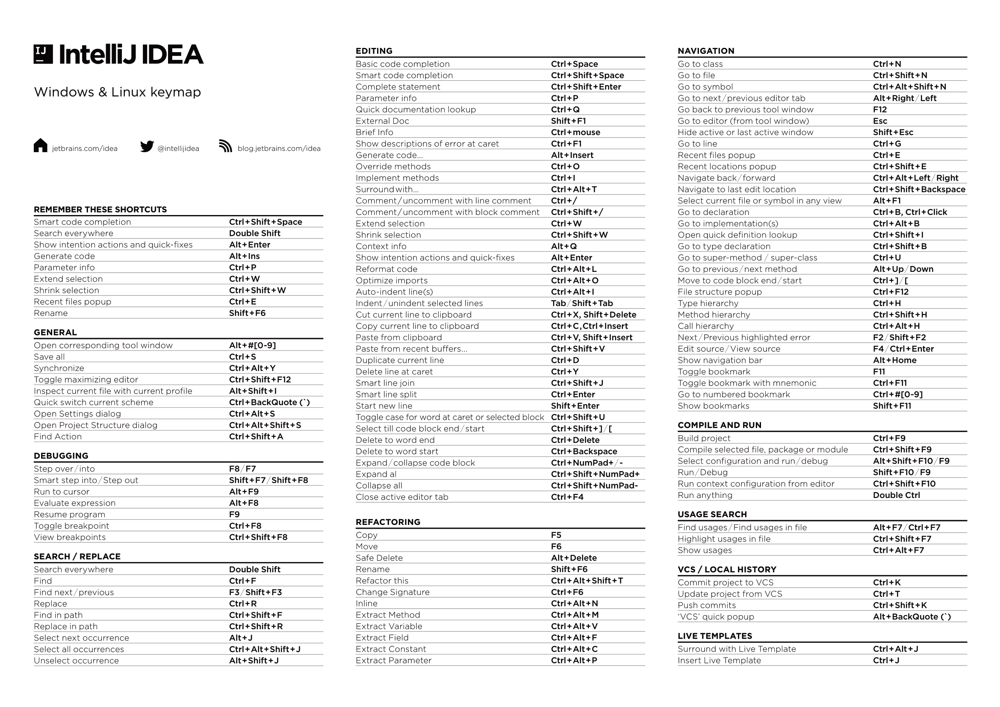
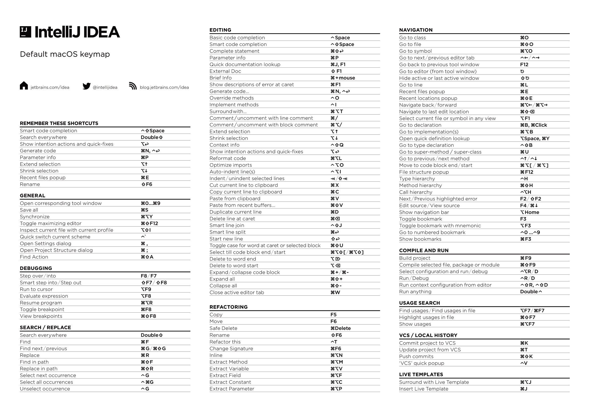

# JetBrains (IntelliJ) Quick Start Guide + Tips and tricks
By Bas Calders v0.4.1b

## Table of Contents

[TOC]

## Prerequisites
###### Disclaimer
Before we begin, let's get some things straight. This guide is intended to provide helpful tips and tricks for using JetBrains Products, IntelliJ in particular, a popular integrated development environment. The information presented in this guide is based on our own experience and research, and is provided for educational and informational purposes only. It is not to be distributed or sold for any form of payment, and should only be applied within a scholarly context. The information provided in this guide is mostly transferable to other JetBrains products, allowing users to apply the tips and techniques to a wide range of similar software.

While we strive to ensure the accuracy of the information presented in this guide, we make no guarantees or warranties regarding its completeness, reliability, or suitability for any particular purpose. Readers are encouraged to conduct their own research and due diligence, and to use the information presented in this guide at their own risk. Any mistakes found and/or suggested updates (e.g.: outdated links) or issues can always be sent to the [author](mailto:bas.calders@gmail.com) or any person of the [Ingenium UA Praesidium](https://www.ingeniumua.be).

Please note that this guide may contain copyrighted material, including screenshots, code snippets, and other intellectual property belonging to JetBrains, the creators of IntelliJ. We believe that our use of such material in this guide constitutes fair use under U.S. copyright law, as we are using it for the purpose of commentary, criticism, and education. However, if you believe that your rights have been infringed upon, please contact us and we will take appropriate action.

In short, while we believe that the information presented in this guide will be helpful to readers, we make no guarantees or warranties, and readers should use their own judgment when applying these tips and tricks in their own work.

### Version
Before proceeding with the tips and tricks in this guide, please note that at the point of writing this, the newest version of IntelliJ is `2023.3`, using the new and improved UI to ensure the maximum longevity of this guide. Additionally, this guide is tailored to users running IntelliJ on a Windows 11 machine. Please note that some tips and techniques may not be applicable to earlier versions of IntelliJ or different operating systems. In most cases MacOS users will be able to replace most usages of <kbd>CTRL</kbd> &harr; <kbd>⌘</kbd> and <kbd>Alt</kbd> &harr; <kbd>⌥</kbd>

## Cheat Sheet
Using a cheat sheet for shortcuts can greatly enhance your productivity and efficiency when using the software. With so many different features and functionalities available, it can be difficult to remember all of the keyboard shortcuts and menu options that are available to you. By using a cheat sheet, you can easily access a comprehensive list of shortcuts and other important information that you need to know, saving you time and effort in the long run.

Furthermore, a cheat sheet can help you become more proficient in using the software and can serve as a valuable reference tool as you continue to work with IntelliJ. By having a printed cheat sheet in front of you, you can quickly find the shortcuts and features you need to use, without having to navigate through menus or search for the information online.

A physical copy of a cheat sheet can be a valuable resource for learning and utilizing keyboard shortcuts in IntelliJ. Unlike a digital copy, a physical cheat sheet allows you to mark it up with notes and annotations, highlight frequently used shortcuts, and create mnemonic devices to help you remember the information more easily. So, printing is highly recommended

A plugin that can help you learn and integrate keyboard shortcuts into your workflow is the [`Key Promoter X`](https://plugins.jetbrains.com/plugin/9792-key-promoter-x) plugin. This plugin is designed to help you improve your productivity by reminding you every time you perform an action that could be done more efficiently using a shortcut. The plugin keeps track of your actions and prompts you with a notification every time an action has a corresponding keyboard shortcut available. This serves as a gentle reminder to use shortcuts and helps you to learn them more quickly by providing immediate feedback. With the help of this plugin, you can gradually integrate keyboard shortcuts into your workflow, leading to faster and more efficient use of IntelliJ.

### Sheets
**_//TODO: update links to work_**

Windows/Linux

Click [here](cheatsheets/IntelliJIDEA_ReferenceCard_Windows-Linux.pdf) to download PDF

MacOS

Click [here](./cheatsheets/IntelliJIDEA_ReferenceCard_MacOS.pdf) to download PDF

## Navigation and Shortcuts

### Recommended shortcut changes: 
When pressing <kbd>ctrl</kbd>+<kbd>Y</kbd> for the first time, You will be prompted with the option to choose between `Redo` and `Delete Line`. We Recommend choosing the option you are most accustomed to in other programs: `Redo`. To fill this void in functionality we van bind `Delete line` to <kbd>alt</kbd>+<kbd>backspace</kbd>. This wil prompt the replacement of `Undo`. But this is no problem since this is also served by <kbd>ctrl</kbd>+<kbd>Z</kbd>.

The Keymap can be edited by pressing the <kbd>⛭</kbd>, then <kbd>Keymap...</kbd>, then <kbd>Configure Keymap...</kbd>

Another good change to make is to bind `Run`, `Build` and `Debug` to dedicated buttons. Macro or unused keys work the best for this, but if needed `AutoHotKey` can also help you with this.

### Table of useful shortcuts
**_// TODO deze moeten herverdeeld worden_**

|Shortcut|Action|
|---|---|
|<kbd>shift</kbd>+<kbd>enter</kbd>|Insert line below|
|<kbd>ctrl</kbd>+<kbd>/</kbd>|comment line|
|<kbd>ctrl</kbd>+<kbd>shift</kbd>+<kbd>/</kbd>|comment code block|
|<kbd>alt</kbd>+<kbd>F8</kbd>|Evaluate expression &rarr; when on a breakpoint in `Debug` run any line of code at that state of the execution| <TODO deze shit moet nog is bezien worden>

### Cursor Navigation
Efficient navigation is paramount for a smooth coding experience. That is why we will focus on efficient cursor navigation using the keyboard. The cursor is primarily moved using the <kbd>arrow</kbd> keys. But we can add on to this with certain key combinations. The first combination is to press <kbd>ctrl</kbd> together with the arrows, this will skip to the next non alphanumeric symbol, this also includes tabs. This is an easy way to quickly go back to a certain point. It is important to note that the <kbd>up/down</kbd> keys are disabled while holding <kbd>ctrl</kbd>. <kbd>shift</kbd> can be used to select while using the arrow keys, this **does** work with the up and down arrows. A combination of both is also possible for the quick selection of words. We also want to mention and emphasize the use of the <kbd>home</kbd> and <kbd>end</kbd> keys. These highly underrated keys can be extremely useful for navigating to the start or end of a line.

### Manipulation
Another hugely underused feature is <kbd>ctrl</kbd>+<kbd>backspace</kbd>/<kbd>del</kbd>, this removes the entire word in front of or behind your cursor (this behavior is also not limited to the IDE 😉 ). As we set up earlier, another great combination is <kbd>alt</kbd>+<kbd>backspace</kbd>, although it must be noted that deleting is seldom the best solution, i'd recommend you to first comment out the line before removing. First commenting out code, then removing it during cleanup is generally the better way to tackle things. A last handy one is moving a selection within the class up or down. This can be accomplished by holding <kbd>shift</kbd>+<kbd>alt</kbd> and pressing <kbd>up/down</kbd>. This can come in handy with code cleanup.

### IDE Navigation
|Shortcut|Action|
|---|---|
|<kbd>f4</kbd>| Jump to source code or definition|
|double <kbd>shift</kbd>|Search everywhere, find things in any file of the project|
|double <kbd>ctrl</kbd>|Run anything|
|<kbd>ctrl</kbd>+<kbd>e</kbd>|Open recent file list|
|<kbd>ctrl</kbd>+<kbd>shift</kbd>+<kbd>e</kbd>|Show recent locations|
|<kbd>ctrl</kbd>+<kbd>alt</kbd>+<kbd>F12</kbd>|Open file location in explorer|
|<kbd>ctrl</kbd>+<kbd>F12</kbd>|Show all members of current file|
|<kbd>ctrl</kbd>+<kbd>F11</kbd>|Make bookmarks and add number mnemonic this can then be jumped to using <kbd>ctrl</kbd>+ the chosen number key|

## Customization 
### Toolbar
Since the *New UI Update* of `IntelliJ 2022.3` and higher the Toolbar has become a nicely customizable part of real estate in the editor. Admittedly customizations are a very personal thing, but still we do have a few suggestions that might make your life that *tiny bit* easier. The upper bar has been subject to change in the updates following `2022.3`, so it might be that these suggestions become obsolete in the future. As for the writing of this guide, these are the edits we recommend.

Firstly adding a `Build` button next to the `Run` and `Debug` buttons. This button is worth more than you'd initially suspect, this will be handled in chapter [Efficiency and Time-Saving](#efficiency-and-time-saving). The next addition to the Toolbar we would make is adding the Version Control buttons `Update Project`/`Pull` (depending on preference), `Commit` and `Push` for quick access. 

After removing some unnecessary actions from the Toolbar and setting a color for your project, your Toolbar might look something like this.

### Other
Another customization option that can help is undocking certain parts of the IDE. We recommend undocking the project tree, as this clears up valuable screen real estate, especially when working with multiple files open at once.

Lastly, we also recommend displaying white spaces, this can easily be enabled by using Search everything or in the search bar of the settings. 

## Advanced Features 

## Integration and Interoperability
- use global settings

## Efficiency and Time-Saving
- plugins like key promoter
- some more ShortCuts

## Best practices and workflows

## Plugins - a List 
Welcome to the chapter on our top recommended plugins for enhancing productivity and introducing quality-of-life improvements in your development environment. As a developer, you understand the importance of having a well-configured workspace that enables you to write clean, efficient, and maintainable code. With countless plugins available, it can be challenging to identify the ones that truly make a difference. In this chapter, we have handpicked a selection of plugins that will not only boost your productivity but also provide those little quality-of-life changes that make coding more enjoyable and less error-prone.

- Key Promoter X
    >The Key Promoter X helps you to learn essential shortcuts while you are working. When you use the mouse on a button inside the IDE, the Key Promoter X shows you the keyboard shortcut that you should have used instead. This provides an easy way to learn how to replace tedious mouse work with keyboard keys and helps to transition to a faster, mouse free development. The Key Promoter X tool window shows you a hit-list of the mouse actions you use the most and directly provides you with the shortcut you can use instead. For buttons that don't have a shortcut, the Key Promoter X prompts you with the possibility to directly create one.

    https://plugins.jetbrains.com/plugin/9792-key-promoter-x
- Github Copilot
    >GitHub Copilot is an AI-driven code completion tool created through a partnership between GitHub and OpenAI. The IntelliJ plugin version of GitHub Copilot aims to support software developers by providing context-aware code snippets and function suggestions while they write code. This advanced tool is built on a deep learning model that has been trained on an extensive range of public code repositories, enabling it to generate pertinent code suggestions across multiple programming languages and frameworks.
    The GitHub Copilot plugin for IntelliJ enhances the coding experience by offering real-time recommendations, which can significantly improve productivity, decrease development time, and assist developers in writing higher-quality code. Although the AI-generated suggestions can be highly valuable, it's important to note that they may not always be perfect or adhere to best practices, so developers should review and adjust the suggestions as needed.

    https://plugins.jetbrains.com/plugin/17718-github-copilot
- Rainbow Brackets
    >Rainbow Brackets is a plugin for JetBrains IDEs, including IntelliJ IDEA, that enhances code readability by color-coding matching brackets, parentheses, and braces in your source code. This visual differentiation allows developers to quickly identify the structure and nesting levels of their code, making it easier to navigate and understand complex code blocks.
    By assigning unique colors to corresponding pairs of brackets, parentheses, or braces, Rainbow Brackets helps reduce the likelihood of syntax errors due to mismatched or missing delimiters. This simple yet effective plugin contributes to a more efficient and enjoyable coding experience, particularly when working with deeply nested code structures.

    https://plugins.jetbrains.com/plugin/10080-rainbow-brackets
- Productivity Bundle 
    >The JetBrains Marketplace Productivity Bundle offers a selection of carefully chosen plugins that aim to boost user experience and productivity within JetBrains IDEs, such as IntelliJ IDEA. By streamlining workflows and optimizing common tasks, the bundle enables developers to concentrate on coding while enjoying improved efficiency. The included tools promote the use of keyboard shortcuts, enhance code navigation, and provide advanced code generation and refactoring capabilities. Additionally, the bundle comes with valuable integrations, such as GitHub Copilot, which offers AI-powered code completion. Overall, the Productivity Bundle significantly enhances the development process within JetBrains IDEs by providing a comprehensive suite of tools to make coding faster, more efficient, and enjoyable.

    https://plugins.jetbrains.com/bundles/4-productivity-bundle
- codeGlance
